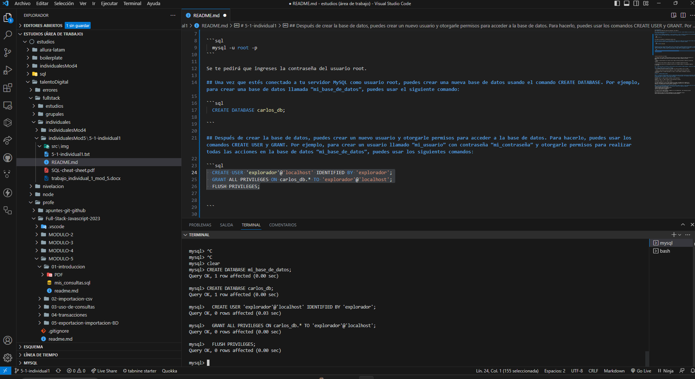

# 5-1-individual1
aqui estaran los trabajos del ejercicio individual 1 del modulo 5 

## 2.- Para comenzar este proceso, en este primer ejercicio se solicitará instalar MySQL en un entorno local. Asumiendo que ya está instalado el aplicativo, se pide hacer lo siguiente:

## Crea un usuario llamado “explorador”, la clave la defines tú. Abre la terminal integrada de VSC presionando Ctrl+` (Windows/Linux) o Cmd+` (macOS). Conéctate a tu servidor MySQL como usuario root usando el comando mysql. Por ejemplo:

```sql
  mysql -u root -p
```

Se te pedirá que ingreses la contraseña del usuario root.

## Una vez que estés conectado a tu servidor MySQL como usuario root, puedes crear una nueva base de datos usando el comando CREATE DATABASE. Por ejemplo, para crear una base de datos llamada “mi_base_de_datos”, puedes usar el siguiente comando:

```sql
  CREATE DATABASE carlos_db;

```

## Después de crear la base de datos, puedes crear un nuevo usuario y otorgarle permisos para acceder a la base de datos. Para hacerlo, puedes usar los comandos CREATE USER y GRANT. Por ejemplo, para crear un usuario llamado “mi_usuario” con contraseña “mi_contraseña” y otorgarle permisos para realizar todas las acciones en la base de datos “mi_base_de_datos”, puedes usar los siguientes comandos:

```sql
  CREATE USER 'explorador'@'localhost' IDENTIFIED BY 'explorador';
  GRANT ALL PRIVILEGES ON carlos_db.* TO 'explorador'@'localhost';
  FLUSH PRIVILEGES;


```



- Al usuario recién creado, asígnale permisos de lectura, escritura en todas las tablas que existan en la
base de datos con nombre “world” (esta es una base de muestra creada al momento de instalar
MySQL).

- Ingresa a la base de datos con el usuario recién creado. Verifica que todas las tablas de la base sean
visibles.

- En un archivo de texto indica el nombre de la tabla y la cantidad de registros que tiene.

El entregable del ejercicio es un documento de texto con el listado de tablas y la cantidad de registros
en cada caso.

## 3.- Usando como datos de referencia la base de datos “world” presente en MySQL Workbench, contesta las siguientes preguntas:

### ¿Cuántas ciudades existen en la base de datos?
- Si se ordenan los países de acuerdo con su nombre ¿cuál sería el primero y cuál el último?

- Tomando en cuenta todos los países de Sudamérica ¿cuántas ciudades existen entre todos ellos?

- Considerando todos los idiomas declarados en la base, ¿cuántos idiomas corresponden a países de
Sudamérica?

## PARTE 2: CREAR UNA BASE DE DATOS

### 4.- La socia de tu proyecto quiere realizar capacitaciones para los futuros usuarios de tu aplicación. Para no perder contacto con los futuros usuarios, te pide que elabores una base de datos con los asistentes a las capacitaciones. En tu ambiente local de desarrollo, crea una base de datos con un nombre personalizado según tu proyecto, la que tenga tres tablas:

OPERADORES: RUN (*), nombre, apellido, dirección, correo electrónico

USUARIOS: id coder (*), nombre, apellido, correo electrónico, teléfono

CAPACITACION: código curso (*), nombre, horario

Los campos marcados con (*) son la clave primaria de la tabla. Los nombres de los campos en la
tabla y el tipo quedan a libre elección, siempre y cuando tenga coherencia con el tema expuesto.
Finalmente, se pide ingresar al diez registros a cada tabla.

### 5.- Dentro de MySQL Workbench existe una base de pruebas llamada “sakila”, la cual almacena datos de arriendo de películas, junto con datos de las películas y actores. Usando estos datos como referencia, conteste las siguientes preguntas:
¿Cuántas películas están registradas?
¿Cuántos clientes existen en la base de datos?
¿Cuántos títulos existen en inventario?
¿Cuál es la película más arrendada?

5.- Luego de utilizar MySQL Workbench, indaguen en el uso de MySQL Shell. ¿Qué diferencias existen
entre utilizar una u otra plataforma?

Pueden apoyarse de todos los recursos disponibles en la web. Recomendamos revisar:
https://www.discoduroderoer.es/creacion-de-tablas-en-mysql-workbench/
